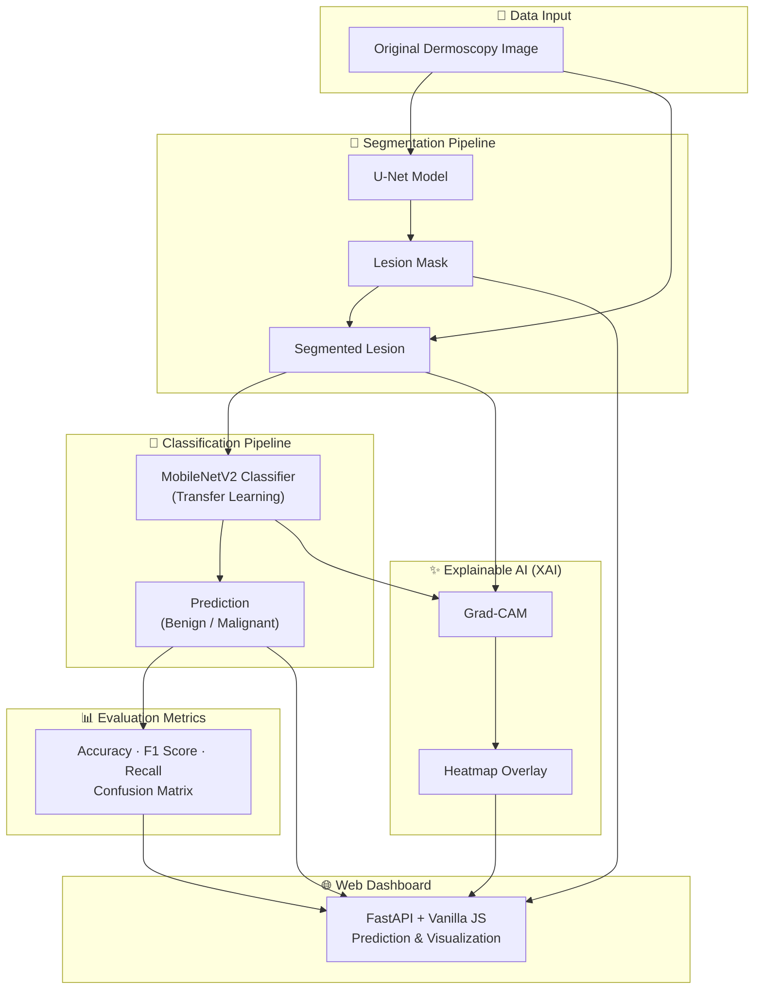

# Skin Cancer Segmentation and Classification

PyTorch implementation of the mini project described in `miniproject abstract new.pdf`.

The project uses a two-stage deep learning pipeline:

1. Segment the lesion with U-Net.
2. Classify the segmented lesion with a transfer-learning classifier such as MobileNetV2 or EfficientNet-B0.
3. Use inverse-frequency class weights during training to reduce class-imbalance bias.
4. Produce Grad-CAM heatmaps so the prediction is easier to inspect.

This is a screening prototype for academic work. It is not a medical diagnosis tool.

## Architecture Diagram



## Project Layout

```text
src/skin_cancer_dl/
  api.py                  FastAPI inference endpoint
  datasets.py             Segmentation and classification data loaders
  inference.py            End-to-end prediction pipeline
  losses.py               Dice and BCE-Dice loss
  models.py               U-Net and torchvision classifiers
  predict.py              Single image prediction script
  train_classifier.py     Classifier training script
  train_segmentation.py   U-Net training script
  utils.py                Image, checkpoint, and metric helpers
  xai.py                  Grad-CAM implementation
  static/                 Browser UI for uploading and analyzing images
scripts/
  prepare_isic2016.py    Organizes the downloaded ISIC 2016 dataset
  smoke_test.py           Quick model sanity check
data/
  README.md               Expected dataset structure
```

## Setup

```powershell
python -m venv .venv
.\.venv\Scripts\Activate.ps1
python -m pip install --upgrade pip
pip install -r requirements.txt
pip install -e .
```

If you do not have internet access when training, omit `--pretrained`. Add it when weights can be downloaded or are already cached.

## Dataset Format

Segmentation data:

```text
data/segmentation/images/ISIC_0001.jpg
data/segmentation/masks/ISIC_0001.png
```

The image and mask must share the same file stem.

Classification data:

```text
data/classification/train/Melanoma/*.jpg
data/classification/train/Basal_Cell_Carcinoma/*.jpg
data/classification/val/Melanoma/*.jpg
data/classification/val/Basal_Cell_Carcinoma/*.jpg
```

You can add more class folders, such as `Nevus` or `Benign_Keratosis`.

## Downloaded Starter Dataset

This project currently uses the official ISIC 2016 starter dataset. Kaggle was not used because the Kaggle CLI and API token were not configured on the machine.

Downloaded files:

- `data/downloads/ISBI2016_ISIC_Part1_Training_Data.zip`
- `data/downloads/ISBI2016_ISIC_Part1_Training_GroundTruth.zip`
- `data/downloads/ISBI2016_ISIC_Part3B_Training_GroundTruth.csv`

Extracted files are stored in:

```text
data/raw/ISBI2016_ISIC_Part1_Training_Data/
data/raw/ISBI2016_ISIC_Part1_Training_GroundTruth/
```

The dataset was prepared with:

```powershell
python scripts/prepare_isic2016.py
```

Prepared project folders:

```text
data/segmentation/images/                  900 images
data/segmentation/masks/                   900 masks
data/classification/train/benign/          582 images
data/classification/train/malignant/       139 images
data/classification/val/benign/            145 images
data/classification/val/malignant/          34 images
```

## Train Segmentation

Command used in terminal:

```powershell
python -m skin_cancer_dl.train_segmentation --image-dir data/segmentation/images --mask-dir data/segmentation/masks --epochs 10 --batch-size 4 --output checkpoints/unet_isic2016.pt
```

Training completed successfully. Best validation Dice score:

```text
val_dice=0.8485
```

Saved checkpoint:

```text
checkpoints/unet_isic2016.pt
```

## Train Classification

Command used in terminal:

```powershell
python -m skin_cancer_dl.train_classifier --train-dir data/classification/train --val-dir data/classification/val --model mobilenet_v2 --epochs 10 --batch-size 8 --output checkpoints/classifier_isic2016.pt
```

Saved checkpoint:

```text
checkpoints/classifier_isic2016.pt
```

`mobilenet_v2` was used because it is lightweight and works better for laptop/CPU training.

## Predict One Image

Command used in terminal:

```powershell
python -m skin_cancer_dl.predict --image data/segmentation/images/ISIC_0000000.jpg --segmentation-checkpoint checkpoints/unet_isic2016.pt --classifier-checkpoint checkpoints/classifier_isic2016.pt --output-dir outputs
```

Generated files:

- `lesion_mask.png`
- `segmented_lesion.png`
- `gradcam_overlay.png`
- `prediction.json`

Example output from `outputs/prediction.json`:

```json
{
  "predicted_class": "malignant",
  "confidence": 0.6834424138069153,
  "top_predictions": [
    {
      "class": "malignant",
      "probability": 0.6834424138069153
    },
    {
      "class": "benign",
      "probability": 0.31655752658843994
    }
  ]
}
```

## Run The Web UI

The project includes a FastAPI browser UI where a user can upload a dermoscopy image and view:

- original input image
- U-Net lesion mask
- segmented lesion
- Grad-CAM overlay
- predicted class and confidence
- benign/malignant probability bars
- lesion area estimate

Run:

```powershell
uvicorn skin_cancer_dl.api:app --host 127.0.0.1 --port 8000
```

Then open:

```text
http://127.0.0.1:8000
```

The UI automatically uses these checkpoints when they exist:

```text
checkpoints/unet_isic2016.pt
checkpoints/classifier_isic2016.pt
```

If you want to use different checkpoints:

```powershell
$env:SEGMENTATION_CHECKPOINT="checkpoints/unet_isic2016.pt"
$env:CLASSIFIER_CHECKPOINT="checkpoints/classifier_isic2016.pt"
uvicorn skin_cancer_dl.api:app --host 127.0.0.1 --port 8000
```

## Optional API

Set checkpoint paths and run the API:

```powershell
$env:SEGMENTATION_CHECKPOINT="checkpoints/unet_isic2016.pt"
$env:CLASSIFIER_CHECKPOINT="checkpoints/classifier_isic2016.pt"
uvicorn skin_cancer_dl.api:app --reload
```

Open `http://127.0.0.1:8000/docs` and use the `/predict` endpoint.
